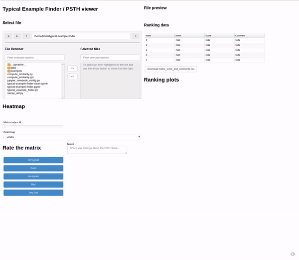

# neuro-matrix-viewer
A dashboard to view and find matrices (population raster, peri-stimulus time histogram) and add comments to them

# Usage instructions 

This tool is currently quite bare bones and rely on just a jupyter notebook and two python scripts.

 1. Clone this repo
 2. Make sure your python environment satisfy the dependencies
 3. Change your directory to src
 4. Run the notebook by typing in your terminal: `panel serve typical-example-finder-clean.ipynb`
 5. As of now, your matrix files needs to be (1) in Xarray format and (2) be contained within the `src` directory, but support for `.mat` and `.npy` files will be available soon.

# Dependencies 

Work in progress: this will be a PyPi package that you can do `pip install` on, but before that, if you want to test it out, you need:

 1. Holoviz Panel
 2. Xarray 
 3. Sciplotlib 
